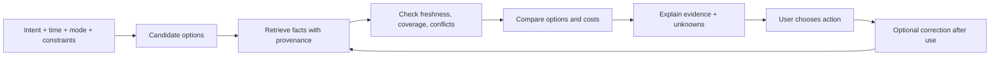

# Contextual safety intelligence without a safety score

Research date: 2026-10-02. **Proposal, not a validated prediction model.**

## Decision

Retire the idea that a place has one stable “7/10 safe” value. The useful unit is a **specific movement decision**: *person intends to do X, from A to B or at place P, by mode M, at time T, with stated constraints*. Output should compare options and expose evidence and uncertainty, never predict whether harm will occur.

The evidence base supports attention to context but not a universal risk percentage. Transport research documents that harassment and fear constrain access to public transport; OECD/ITF reports that women avoid unpopulated places and particular streets. A 2026 campus streets experiment found lighting pattern and visibility affect perceived safety, but its authors note the need for behavioural validation. Perceived comfort matters to mobility; it is not equivalent to measured victimisation risk. [ITF women's safety](https://www.itf-oecd.org/womens-safety-security), [OECD/ITF walking and cycling review](https://www.oecd.org/content/dam/oecd/en/publications/reports/2023/12/improving-the-quality-of-walking-and-cycling-in-cities_2fd6b6ec/cdeb3fe8-en.pdf), [campus streets experiment](https://link.springer.com/article/10.1007/s44515-026-00011-3)

## Decision object

| Input | Why it matters | Data quality warning |
|---|---|---|
| Intent and mode | A run, cab pickup, train transfer and late hotel arrival require different options. | Ask, do not infer sensitive intent from location. |
| Time and daylight | Changes lighting, service, staffing and activity. | Daylight is calculable; actual lighting and activity need data. |
| Route/place geometry | One difficult segment can dominate a route. | Avoid broad neighbourhood stereotypes. |
| Feasible alternatives | User needs a choice she can actually take. | Time, cost, accessibility and detour burden matter. |
| Place operation | Open, accessible, staffed, public, suitable for this scenario. | “Listed open” does not prove a staff member is present. |
| Recent observations | Conditions change and local knowledge can fill gaps. | Sparse submissions are not representative. |
| Official/service data | Transit, weather, advisories, local emergency numbers. | Coverage and authority differ by country. |
| Personal preferences | Desired cost, mode, contacts, familiar route. | Explicit and revocable; no paternalistic defaults. |

## Evidence grammar

Every consequential claim should have: **claim**, **source**, **observation time**, **spatial scope**, **validity window**, **verification level**, and **known gap**. Internal logic can weigh signals, but user facing copy should use intelligible terms: “confirmed today,” “listed hours,” “recent community observation,” “older report,” “unknown.” Avoid absolute safe/unsafe assurances or “82% safe.” Give a clear comparative recommendation when reliable evidence supports it; cautious language must not obscure a useful choice.

An example answer shape:

> “For a 4:45 AM run, this loop will still be dark. I have current opening hours for one staffed place on the main road, but no recent checks for the quieter stretch. The main-road loop adds seven minutes and has that open option. I can show both routes. I can't determine whether either route will be free of harassment.”

This wording is illustrative, **not** a claim that Mira has those data for a real location. It answers the decision rather than retreating to a generic disclaimer. WHO uncertainty guidance recommends acknowledging evidence limits while giving proportionate, usable advice; NIST's AI framework calls for validity, transparency and ongoing evaluation. [WHO](https://www.who.int/europe/publications/communicating-uncertainty-in-health-emergencies-guidance-and-tips), [NIST](https://airc.nist.gov/airmf-resources/airmf/3-sec-characteristics/)

## Reasoning sequence

**Hard gates:** no option without a feasible route or service; no “open now” if the source is stale; no “staffed” from opening hours alone; no claim of live crowd density without an authorized live source; no “low risk” classification from silence in the report database; no route superiority claim if differences are within data uncertainty. Give the best known option *for stated criteria* only when evidence supports it. Google Places `openNow` and `OPERATIONAL` are not proof of staffing or public access. [Google Places fields](https://developers.google.com/maps/documentation/places/web-service/reference/rest/v1/places)

## Help Point becomes “usable option”

The present code already classifies hospitals, police, rail stations, hotels, pharmacies and fuel stations; it considers hours, walking distance and country weights, and explicitly avoids calling a place safe or staffed from “open.” [Help-point logic](../../src/domain/help-points.ts). That is a sound caution. The missing product test is **scenario suitability**:

| Situation | Primary option attributes | What nearest-only misses |
|---|---|---|
| Feeling followed | Enterable public place, staff/activity now, simple route, quick arrival | A police station may be farther or closed to walk-in access; route to it may be isolated. |
| Medical emergency | Appropriate care and emergency contact | A nearby pharmacy is not an emergency department. |
| Stranded at a transit stop | Operating service or staffed station, onward route | Station type does not prove trains/staff at this hour. |
| Uncomfortable cab pickup | Well-defined public pickup location, transport alternative, contact share | A map pin alone does not establish pickup access. |

For imminent danger, show the locally reviewed emergency path prominently; an “open” hotel is not an emergency service. For non-emergency discomfort, offer practical options without pushing a police response the user did not request.

## Conceptual minimum data model

`MovementIntent`; `JourneyOption` (mode, geometry, duration, cost/accessibility constraints); `Place` (entrance, role, access, hours, staffing evidence); `SegmentCondition` (lighting, closure, visibility, activity evidence); `Observation` (time, source, privacy, verification); `Service/Advisory` (official source, geography, validity); `EvidenceClaim` (provenance and uncertainty); `UserPreference` (consent and retention); `ActionState` (suggested, accepted, executed, failed). This is a vocabulary for product reasoning, **not** a database migration proposal.

## Evaluation before public claims

Construct situation sets across cities, times and modes. Ground truth should cover operational facts (hours, service, route, access) and user assessed usefulness; it cannot label an entire route “safe.” Track factual error, stale data, harmful omission, unnecessary alarm, misunderstood confidence, time to usable option, and whether women choose to move with better information. Audit performance separately in low coverage regions. Research on lighting and activity speaks more clearly to *perceived comfort and mobility* than to prevention of violence; the UK Home Office has noted limited evidence about interventions preventing violence against women and girls in public spaces. [UK Home Office](https://assets.publishing.service.gov.uk/government/uploads/system/uploads/attachment_data/file/991116/Public_Spaces_investment_-_Guidance_for_Bidders.pdf)
