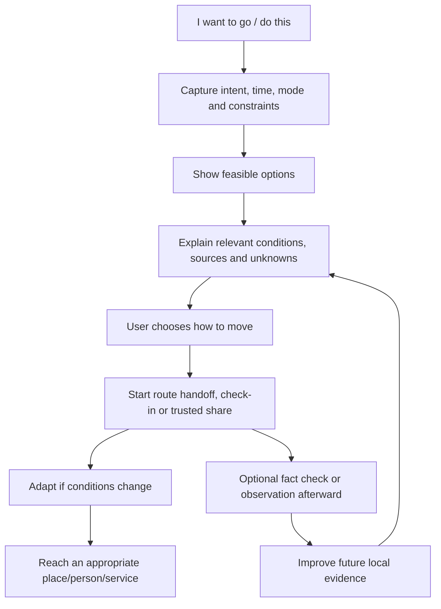

# Proposed product thesis and user-facing architecture

Research date: 2026-10-02. **Proposal for founder and user validation, not a frozen thesis.**

## Thesis

**Mira helps women make and adapt real-world movement decisions with context they can inspect and actions they can use.** It begins with what a person wants to do, compares feasible options for that time and place, explains what is known and unknown, then helps her follow or change the plan. Its purpose is more freedom of movement, not continuous hazard awareness.

This interprets “Make the world safer for women to travel” as a *decision and support* product. It does not claim an app can prevent violence or assign a credible probability of harm to a street. The runner test shows the gap between the user's action decision and a nearby help-point list; broader research finds women routinely adjust journeys by time, route, mode, company and familiarity. [User research](02_USER_NEEDS_RESEARCH.md).

## Positioning

**For:** women making an unfamiliar or changed journey, initially those with a concrete near-term decision they would otherwise piece together from Maps, web search, friends and intuition.

**When:** before or during a run, walk, commute, late return, ride pickup, transfer or arrival.

**Promise:** “Know what matters for this move, see workable options, and have a practical next step.”

**Trust promise:** Mira shows evidence freshness and gaps and never assures safety. It respects a woman's own judgement and never treats her movement as a problem to discourage.

## Primary initial user and wedge

The recommended initial user is an adult woman who moves independently in a city and regularly encounters *changed or unfamiliar movement contexts*: early/late journeys, new routes, last-mile travel and unfamiliar destinations. This is a behavioural segment, not a demographic stereotype. Start with near-term, urban, point-to-point or loop decisions because they are frequent enough to test retention and can be grounded in map/place/time data. The early-morning runner is one test scenario, not the entire product.

Choose a **bounded pilot geography** for high-confidence local intelligence while allowing a limited global planning mode. Current repository material frames a DU North Campus pilot; that should be treated as a deployment and data starting point, not as proof that India-only needs generalise. [Current country coverage](../COUNTRY_COVERAGE.md).

## Product architecture (what the user experiences)

This is one system with several surfaces, not seven equal tabs. **Ask Mira** should accept natural intent and explain evidence; structured prompts may be faster for common jobs. **The map** should display the decision and alternatives, not force a user to reverse-engineer meaning from pins. **Help options** should be ranked for the situation and current usability, not proximity alone. **Community** should improve the evidence layer; its output appears where it changes the decision. **Emergency help** remains immediately reachable with a separate urgent interaction.

## Primary jobs

1. Decide whether and how a desired movement is workable at the actual time.
2. Choose between feasible routes, modes, times or pickup/arrival plans.
3. Move with low-attention support and a reversible contact/check-in option.
4. Adapt quickly when a service, route or social situation changes.
5. Reach appropriate human or emergency help when needed.
6. Correct or contribute a useful fact without exposing a personal routine.

## Day 1, 7, 30 and network value hypotheses

| Horizon | Value to prove | Evidence needed |
|---|---|---|
| Day 1 | One decision is clearer and a next step is usable without setup or community density. | Task comparison vs LLM + Maps. |
| Day 7 | A repeat or changed journey takes less planning effort; saved choices reduce friction with consent. | Repeat-use diary, time-to-decision. |
| Day 30 | Place/route corrections and user-approved preferences make recurring answers more relevant. | Measured improvement in accuracy/utility, privacy comprehension. |
| Network | Independent local checks make conditions fresher and fill specific gaps. | Coverage, correction latency, contribution quality, bias metrics. |

These are hypotheses, not retention data. Emergency activation and anxiety-provoking notifications should not be used as engagement goals.

## Tone

Lead with the person's objective and a practical option. Name the conditions and evidence without dramatizing them. Use short sentences under pressure. Acknowledge intuition (“If something feels wrong, you can change plans”) without claiming that feelings alone prove a location dangerous. Avoid a police bulletin, legalistic caveat, parental instruction or “you will be safe” assurance. Test tone with women across languages and contexts; no source establishes one universal preferred personality.

## Non-goals for the next stage

No universal area score, turn-by-turn map replacement, public incident feed, passive tracking, broad tourism itinerary product, or confident global route-level predictions. These either fail the substitution test, the evidence test, or the privacy test. See [opportunities](08_PRODUCT_OPPORTUNITIES.md).
