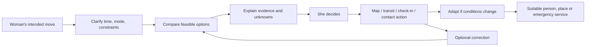

# Mira product research synthesis — decision draft

2 October 2026 · Research and audit only · **Thesis proposed, not frozen**

## Executive decision

**Proposed thesis:** Mira helps women make and adapt real-world movement decisions with relevant, inspectable context and usable next steps. The first product test should be a specific journey choice (“I want to run outside at 4:45 AM,” “I leave work at midnight,” “I land late and need to reach my hotel”), not a safety score or a general chat answer. Mira should compare feasible choices, state what evidence is fresh or missing, and support the chosen move. The aim is to enable movement, never to promise it will be safe.

**Do not freeze this yet.** The research establishes a widespread decision burden, but it does not prove Mira's concept improves outcomes or beats current alternatives. Mira's distinctive local data layer is still sparse and its cost to verify is unknown. Run the validation gates below before the redesign.

Evidence labels used here: **Observed** = current repository or running signed-out UI; **External evidence** = cited research/product source; **Hypothesis** = proposed interpretation requiring Mira user tests.

**Audit limit:** the local app was inspected signed out, without real location or provider credentials. Signed-in trip, report and location behaviour was audited through code and tests, not a live field trial. External studies span different countries and samples; none proves Mira prevents harm or establishes global demand for this product shape. [Audit method](01_CURRENT_PRODUCT_AUDIT.md), [research limits](02_USER_NEEDS_RESEARCH.md).

## A–G. Product, problem and focus

| Question | Decision-oriented answer |
|---|---|
| **A. What is Mira today?** | **Observed:** a five-tab safety companion hub: Today, Around, Mira, Contribute, You. It offers place and route briefs, mapped lighting, Help Points, emergency actions, short followed journeys, Circle contacts, private reports, checks/corrections, updates and a tool-using chat. The map is one level under Around. [Audit](01_CURRENT_PRODUCT_AUDIT.md). |
| **B. What is broken or unclear?** | **Observed:** the user must assemble meaning from several evidence surfaces. Ask Mira can launch tools but generally declines safety judgements; it does not compare a 4:30 AM runner's viable options. Help Point walking time is an estimate from straight-line distance, with unverified staffing/access. Community releases are off by default and would be sparse/slow. Signed-out users cannot converse with Mira. No product success funnel exists. [Audit](01_CURRENT_PRODUCT_AUDIT.md), [internal Mira eval](../MIRA_EVAL.md). |
| **C. What need is underserved?** | **External evidence:** women routinely change time, route, mode, travel companion and transit behaviour; the burden spans planning, waiting, transfers, the last stretch and adaptation. In England's 2023 national survey, 63% of female respondents said they avoid solo travel when dark and 45% had chosen a route for safety (*ever done*, not frequency). **Hypothesis:** a tool that reduces the work of *deciding and adapting* can create value beyond alerts and SOS. [User research](02_USER_NEEDS_RESEARCH.md), [UK DfT survey](https://www.gov.uk/government/statistics/national-travel-attitudes-study-wave-8/national-travel-attitudes-study-wave-8). |
| **D. Primary job** | Help a woman pursue a desired movement by answering: “What are my workable options in this context, what do we know about them, and what can I do if conditions change?” This is a **hypothesis** to test across situations. |
| **E. Primary initial user** | **Proposal:** an adult woman moving independently in a city whose route, timing or destination has changed or is unfamiliar. This behavioural wedge covers the runner but does not treat all women as one persona. Test disability, income, transport access and local familiarity variations. |
| **F. First situations** | (1) early/late local walk or run; (2) return from work or a social event; (3) unfamiliar last-mile or late arrival. They expose time, route, place, transition and support needs. Start with a bounded pilot geography for verified local claims. |
| **G. Deliberately later** | Broad tourism itineraries, continuous personal tracking, a universal “safest route,” public incident feed, emergency dispatch, navigation replacement and global verified-refuge claims. These either have weak evidence, high privacy/reliability costs or strong incumbents. |

## H–K. Differentiation and community

| Question | Answer |
|---|---|
| **H. Why over Google Maps?** | Today, often **no strong reason** for directions, ETA, nearby places or listed hours. Google already offers Gemini within Maps navigation. Mira has a potential edge only when it adds *verified, recent, situation-specific facts and a better decision*, such as an actual accessible staffed option or a checked segment condition that changes the route/time choice. [Gemini in Maps](https://support.google.com/maps/answer/6041199?hl=EN), [competitive audit](03_MARKET_COMPETITIVE_RESEARCH.md). |
| **I. Why over ChatGPT/Claude?** | Generic assistants already search, use location and synthesize travel advice; Gemini accesses Maps. A safety persona is insufficient. Mira's candidate value is local evidence with provenance and expiry, option comparison under explicit rules, action state, and an optional correction loop. This is **unproven** until a Mira-only signal changes a real user's decision. [AI substitution audit](05_MIRA_VS_GENERIC_AI.md). |
| **J. Community's role** | Supply structured observations and corrections to the evidence layer, not a stream of reports. Prioritise place access/hours, route conditions, service changes and positive options. Sensitive incidents enter privately and surface only under appropriate privacy, moderation and coverage rules. Current Mira Checks and corrections are a promising seed; current thresholded notes are too slow/sparse to be the primary answer. [Community model](04_COMMUNITY_INTELLIGENCE.md), [audit](01_CURRENT_PRODUCT_AUDIT.md). |
| **K. Compounding advantage** | A provenance-rich history by segment/place/time/mode and its correction performance could become distinctive **if** independent contribution density and verification economics work. Google/OSM place data have licensing and caching constraints and should not be called Mira's proprietary asset. The defensible asset would be original, consented observations and quality operations, not a scraped POI database. [Google Places policies](https://developers.google.com/maps/documentation/places/web-service/policies). |

## L–Q. Experience architecture

| Question | Answer |
|---|---|
| **L. Ask Mira** | **Proposal:** primary flexible intent and explanation surface, paired with quick structured entry for common tasks. It should ask the minimum missing question, retrieve eligible evidence, compare options and offer an executable next step. The LLM should never invent local conditions or claim an action is complete without a receipt. Conversation alone is not the product. |
| **M. Map** | Inspect routes, conditions and alternatives and hand off navigation. It should support a chosen decision rather than act as a homepage of pins. **Hypothesis:** intent-first may outperform map-first for the target jobs; test before setting final navigation. |
| **N. Help Points** | Become *usable options for this situation*: likely open, public, accessible, appropriate, reachable by a real route, with staffing separately verified. Current hours-aware ranking is useful but cannot establish these facts. Separate discomfort from medical/police emergency. [Model](06_SAFETY_INTELLIGENCE_MODEL.md). |
| **O. User knowledge** | Start with explicit mode, saved places, preferences and per-trip trusted contacts. Keep history minimal and revocable. Avoid passive routine inference and deviation alerts in the first phase. Current habits default on and exact user chat text persists up to 30 days; audit whether those defaults earn their privacy cost. [Audit](01_CURRENT_PRODUCT_AUDIT.md), [privacy model](07_PRIVACY_TRUST_SAFETY.md). |
| **P. Proactivity** | Respond to direct questions by default. Test optional, plan-linked prompts for a late arrival or selected journey; notify only when information is new and actionable. No continuous hazard notifications or inferred-routine alerts by default. |
| **Q. Day 1 / 7 / 30** | **Hypotheses:** Day 1 gives one usable choice with existing facts; Day 7 reduces effort for a repeat or changed journey; Day 30 improves with user-approved preferences and checked local facts. Network value occurs when corrections measurably improve factual quality. There is no Mira retention evidence yet. |

## R–U. Priorities, removals, feasibility and risks

### P0 — core value cannot work without these

1. Intent-to-options flow for a concrete movement, including a useful answer when evidence is thin.
2. Provenance and freshness rules for every consequential claim; distinguish known, listed, reported, inferred and unknown.
3. Feasible option comparison: time, mode, route, cost/accessibility constraints, actual alternatives and tradeoffs. Do **not** call a route “safest.”
4. Scenario-suited help options with clear hours/staffing/access limits and a routed path where available.
5. Separate fast emergency path and truthful action state for calls, shares, check-ins and handoffs.
6. Privacy controls around location, contacts, raw chat text and reports; no default passive trail. Measure usable decisions and factual failures without raw location history; the current app has no product funnel.

### P1 — differentiation and recurrence

7. Structured, consented observations and corrections with moderation, expiry and bias checks.
8. Local verification operations for place access, staff and route conditions in the pilot area.
9. User-approved journey preferences and optional, revocable contact support.
10. A scoped late-arrival/last-mile brief where operational data can be verified.

### P2 — later, conditional

Plan-linked proactive prompts; transport service partnerships; wider city coverage; route-level community patterns after adequate density and validation.

### Do not build yet / de-emphasise

No global or area safety score, public report feed, danger gamification, default continuous tracking, own navigation engine, or broad generic travel chatbot. De-emphasise Today news/local pulse as a primary task, separate Scout/impact branding and report count as a success measure. Merge place, route, lighting, help and Ask Mira into one decision experience only after user testing confirms the hierarchy. Preserve the underlying data and privacy work that already exists. [Audit](01_CURRENT_PRODUCT_AUDIT.md), [opportunities](08_PRODUCT_OPPORTUNITIES.md).

**T. Unrealistic today:** live crowd/behaviour inference at route level, global verified staffing/access, validated harassment probabilities, real-time proactive awareness without extensive data and consent, a guaranteed followed journey from a foreground-only PWA, and emergency dispatch without trained operations. Country-specific emergency context can be global only where reviewed; current documentation cites 60 reviewed profiles of 195 countries. [Current beta record](../PUBLIC_BETA_FREEZE.md), [opportunities](08_PRODUCT_OPPORTUNITIES.md).

**U. Biggest risks:** false reassurance or unnecessary alarm; stale/open-but-unusable places; crowd data and report bias; malicious accusations and neighbourhood stigma; treating occupation, class or appearance as a danger proxy; exposure of location routines to abusers; model confabulation and false action claims; thin geographic coverage being mistaken for “nothing happened”; weak reliability of contacts/push/background trip support. NIST's AI framework is a useful engineering risk lens, not evidence that a particular answer format works. [Privacy model](07_PRIVACY_TRUST_SAFETY.md), [NIST](https://airc.nist.gov/airmf-resources/airmf/3-sec-characteristics/).

## V. What to validate before redesign/build

1. **Journey diaries and interviews:** 20–30 women across different mobility, income, disability, familiarity and travel contexts; record their last changed/skipped journey and current tool stack. This sample is for mechanism discovery, not prevalence claims.
2. **Blinded crossover benchmark:** early run, late return, unfamiliar arrival and “feeling followed” tasks against Gemini in Maps and ChatGPT plus Maps on the same device. Pre-register operational fact accuracy, critical errors/omissions, usable-option rate and time, uncertainty comprehension, anxiety and whether Mira-only evidence changes the choice. A candidate go/no-go threshold is at least a 20 percentage-point usable-option lift with no worse critical-error rate; power the study before treating it as a decision rule. [AI substitution audit](05_MIRA_VS_GENERIC_AI.md).
3. **Pilot data field audit:** verify real places' hours, public access, staffing and routed ETA at relevant times; sample segments for lighting/conditions. Measure coverage and checking cost, not just database counts.
4. **Contribution and abuse tests:** determine what women will share after a routine trip, discomfort or incident; test anonymity, correction, retaliation concerns and malicious submissions.
5. **Privacy and delivery drills:** test a revoked trip link, lost/compromised phone, notification preview, hidden browser tab, failed worker/email/push and wrong emergency country.
6. **Longitudinal value:** a four-week pilot should show repeated *useful movement decisions* and improved local facts, not simply opens, alerts or report volume.

## Freeze sequence

1. Founder decides first wedge, pilot geography, publication policy and privacy boundary. [Decisions](10_DECISIONS_NEEDED_FROM_FOUNDER.md).
2. User research confirms the job and language; competitor benchmark establishes a measurable advantage.
3. Field audit establishes which local claims Mira can truthfully make and at what operating cost.
4. Then freeze **thesis → positioning → user-facing architecture → evidence contract → feature priorities → UX redesign**. Do not equate a compelling mock answer with a validated product capability.

## Research dossier

[01 Current product audit](01_CURRENT_PRODUCT_AUDIT.md) · [02 User needs](02_USER_NEEDS_RESEARCH.md) · [03 Market](03_MARKET_COMPETITIVE_RESEARCH.md) · [04 Community](04_COMMUNITY_INTELLIGENCE.md) · [05 Mira vs AI](05_MIRA_VS_GENERIC_AI.md) · [06 Intelligence model](06_SAFETY_INTELLIGENCE_MODEL.md) · [07 Privacy](07_PRIVACY_TRUST_SAFETY.md) · [08 Opportunities](08_PRODUCT_OPPORTUNITIES.md) · [09 Thesis](09_PROPOSED_PRODUCT_THESIS.md) · [10 Founder decisions](10_DECISIONS_NEEDED_FROM_FOUNDER.md).
