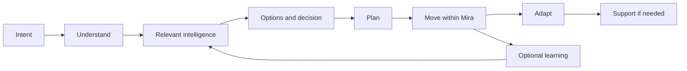

# Frozen mission and thesis

## Mission and position

**Mission:** make the world safer for women to travel. Travel means movement through the physical world: local, routine, unfamiliar, domestic and international.

**Product thesis:** Mira is a **personal travel and movement intelligence companion for women**. Given “I want to go/do this,” she helps the person **understand → plan → navigate → adapt → get support when required**. Start from intent, not a map, a crime feed or a generic chatbot.

Mira's decision object is `intent + place/destination + route + time + mode + situation + relevant user constraints`. Its answer is `known context → relevant unknowns → viable options → practical next action`. A universal opaque safety score and a guarantee of safety are prohibited. A plain comparative recommendation is allowed only when evidence supports it and limitations remain visible.

## One coherent product

Map, route, daylight, place hours, support locations, official advisories, local developments, community observations, chosen preferences, contacts and journey state are **inputs**. They do not each deserve a homepage module. Community helps Mira understand conditions; users are not asked to consume a report stream. News is eligible only when it can change this movement decision. Owning a journey and navigation experience is in scope; owning global mapping/routing infrastructure is not.

## Product boundary and principles

- Expand around the journey. A date may require venue, arrival, departure, return and support context. Fashion, dating, therapy, relationship and generic lifestyle advice are outside core scope.
- Make movement more possible. Relevant options and trade-offs come before warnings. Do not optimize daily opens, frightening notifications or report volume.
- Keep the woman in control. Mira proposes; she chooses. Start, share, contact and contribute require explicit action.
- State claim type and freshness. “Listed open” is not “staffed.” “No reports” is not “safe.” Failure is not “nothing found.”
- Do not classify people, occupations, class or neighbourhood residents as threats. Discuss observed behaviour or physical conditions only.
- Use the existing privacy/security baseline as a floor, not permission to collect more data. No passive location trail.

## Feature admission test

**A:** Does it help understand, plan, make, navigate or adapt a physical-world journey? **B:** Does it add specialised movement intelligence or actionability that materially improves that journey? A feature that passes neither is removed or kept outside core. A feature that passes A but is indistinguishable from Maps plus a general AI assistant must show specific incremental utility before becoming a priority.

## Explicit non-goals

No universal safety score, public crime/report feed, fear notifications, generic city news feed, general social network, gendered lifestyle chatbot, travel booking marketplace, cab platform, own routing infrastructure, “AI predicts crime,” default continuous tracking, unverified global route-safety claims or emergency dispatch without operations. A future research-backed index is not V1 work. [Research synthesis](../mira-product-research/MIRA_PRODUCT_RESEARCH_SYNTHESIS.md).
