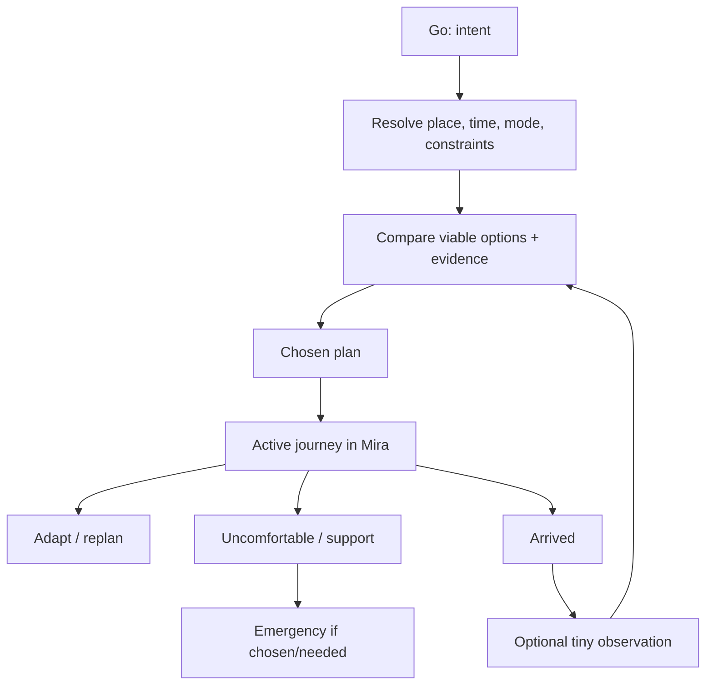

# Target user-facing product architecture

**Local implementation state (Phase 7):** Go/Journeys/You, contextual Ask/map links, direct Emergency, legacy `/today`, an encrypted explicit saved-plan flow and paused legacy habits are in the working tree. The active journey remains foreground-only. The figure and A–R table describe the full target; they do not assert that staffed support, route-linked community claims, turn guidance or external outcome validation exists. [Gate status](20_ACCEPTANCE_TESTS.md).

## Primary experience

The home screen is **Go**: “Where are you going, or what do you want to do?” with one primary intent CTA and fast repeat choices. The first useful result is not a map pin or a chat monologue; it is a plan card with options, material differences, uncertainty and a next action. Current context appears only when relevant to an entered intent or active journey. A signed-out user can plan with baseline sources; account is required only for saved history, contact sharing and protected contribution.

## Surface roles (A–R)

| Surface/question | Contract |
|---|---|
| **A/B Home + CTA** | Intent input (“I want to…”), start/resume journey, recent user-approved plan. CTA is “Plan a move” / “Tell Mira your plan”; active journey takes precedence. |
| **C Ask Mira** | Conversational way into and through the same plan object, including mid-journey questions. It never owns a separate factual universe. |
| **D Map** | Spatial view of options and evidence; choose/inspect route, place and support. No generic danger heatmap. |
| **E Navigation** | Mira owns the foreground active-journey experience and context; a licensed provider computes route geometry/turn guidance where available. No implied background guarantee. |
| **F Today/context** | Conditions and updates appear only for the current or planned movement, with source/age. No “Today” feed required. |
| **G Around** | Search/place intelligence becomes part of destination resolution and comparison. `/around` may redirect or remain a compatibility entry during migration. |
| **H Contribute** | Tiny post-journey or place correction entry, plus optional private report in You/support. No primary feed/tab. |
| **I You/Profile** | Saved places/plans, preferences, privacy, trusted contacts, history and account controls. |
| **J Local news** | A verified, time-bound local development claim only when it affects this trip; otherwise silent. |
| **K Help Points** | Support options ranked by situation, availability evidence, reachable route and user constraints; never mere nearest pins as a promise. |
| **L Reports** | Optional private intake; eligible aggregated or checked claims flow back into decisions. No public accusation stream. |
| **M Circle** | Optional chosen people for sharing/check-in; user can see recipients, delivery state and revoke. |
| **N Journeys** | Plan → choose → active → adapt → arrive; historical plans persist only by consent. |
| **O Active navigation** | Current route, next useful instruction (if supported), ETA, source/status, support action and glanceable change prompt. Avoid distracting alerts. |
| **P Change** | Keep intent/constraints, refresh options using current position/time, show what changed, ask before replacing route or notifying others. |
| **Q Uncomfortable** | Immediate practical choices: enter a suitable known place, contact someone, change route/mode, emergency pathway. Do not force a chat turn. |
| **R Emergency** | Persistent direct emergency action with reviewed local number when available, dialler only, transparent unknown-country state. Never claim dispatch. |

## User states

Guest with no location can plan a named origin/destination and future time. Guest with location can plan from here. Signed-in can save and share. Active journey temporarily changes navigation prominence. Low coverage is a first-class state of each claim, not an overall badge. Offline/no network preserves emergency information only if reliably bundled and current; otherwise show device dialler/manual contact guidance without invented numbers.

The target IA, screen states and V1 boundary are specified in [13](13_INFORMATION_ARCHITECTURE.md), [14](14_SCREEN_STATE_INVENTORY.md) and [15](15_V1_PRODUCT_CONTRACT.md).

## How Mira earns a return visit

Recurrence follows another real movement decision. The home surface changes with **user-approved** state, not a feed or daily nudge.

| Moment | Value earned | Product behaviour and boundary |
|---|---|---|
| First session | A useful choice for an imminent or future movement without sign-in/location permission | State intent and time, inspect viable options and unknowns, take one next action. If local coverage is thin, use reliable route/daylight/country facts and say what remains unverified. |
| Second session | Less repeated setup | With explicit save, reuse a named origin, destination, constraints or earlier plan; let the woman edit time/mode before recomputing. Without save, start fresh and do not imply memory. |
| Week 1 | Practical continuity across repeat run/commute or trip legs | A chosen repeat plan can be refreshed against today's conditions when opened. Active journey can be changed and completed. Optional arrival correction can resolve a known gap. No automatic alert from inferred routine. |
| Month 1 | More trusted personal shortcuts and clearer local evidence | Saved choices and consented preferences reduce steps; independently corroborated, still-fresh community facts may improve a route/place comparison where coverage exists. An absent network yields the same honest baseline. |
| Network | Better answers for the next relevant movement | Narrow corrections improve place/route facts after moderation, independence, expiry and withdrawal. Do not reward submission volume or display a random report stream. |

Use **completed useful decisions, repeat task success, corrections and avoidable failures** to assess retention; distinguish needed re-use from notification-driven opens. The woman may disable history and still plan. Proactive information is limited to an active or explicitly saved upcoming journey with a user-approved trigger, fresh evidence and a material change; it must explain why it appeared and offer a quiet setting. [Data controls](16_DATA_AND_PRIVACY_CONTRACT.md).
