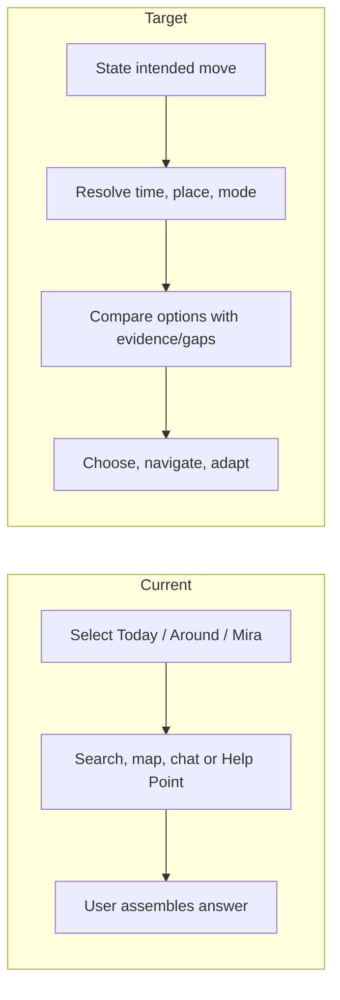

# Core journeys — current versus target

All target flows use the same intent → evidence → options → plan → move → adapt/support loop. The “Current” column is the original pre-vNext baseline retained for migration comparison; current local implementation and remaining gaps are in [20](20_ACCEPTANCE_TESTS.md). The target is a contract, not current behaviour. “Unknown” must never be recast as “no problem.”

| Scenario | Current flow, available information/actions and fallback | Thesis gap | Target flow |
|---|---|---|---|
| **A. 4:45 AM run** | Check a place/route in Around; walking alternatives and mapped lighting may appear; Help Points/notes may be sparse. Ask Mira has no loop intent or future-time route comparison and is instructed to decline safety verdicts. Can plan a walk/share after sign-in. | No run/loop model, specific departure time, route context synthesis, verification of an open place. | Enter “run outside at 4:45” plus start/loop or distance; infer daylight from date/place; compare feasible loops/time alternatives and evidence; show unknown stretches and support option; choose route and foreground journey; optionally correct a condition afterward. Do not infer risk from workers or strangers as a group. |
| **B. Leave office at midnight** | Saved office/home may exist; Mira can propose home trip; map shows walking context, ride/transit provider may give one route; Circle sharing/check-in exists. | Last service, pickup and departure transition are not a combined choice. | Resolve office→home at midnight, compare walk/ride/transit only where service/route facts exist, name operational unknowns, let her choose and start. Mid-trip cancellation returns to same plan with changed time/place. |
| **C. Unfamiliar date/event** | Search venue, see place brief and walk; safety updates city level; journey share possible. | No arrival/departure/return plan or event context. | Resolve venue/time and intended return; prepare arrival/pickup and departure options, user-approved contact/check-in; keep date advice within movement boundary. Active departure can resume plan. |
| **D. Arrive in another city late** | Current-location Mira only gives future destination generic capability; direct search/map can inspect remote place, but does not handle landing time or hotel journey. | Remote/future context, airport/terminal, hotel access, transport availability. | Enter arrival city/airport, time and hotel; ask for missing hotel or arrival point once; compare available arrival modes using dated provider/official facts; label unverified service/hotel staffing; save arrival segment and navigate from chosen point when there. |
| **E. International solo trip** | Country emergency profile exists where reviewed, global search/routes and city news. No trip itinerary/context model or local-law/arrival decision flow. | Multi-stage plan and evidence for future destination. | Create basic trip plan: arrival and first transfer, stay location, return connection, reviewed country essentials and evidence gaps. No booking, broad itinerary or cultural stereotypes. Each local leg reuses movement-plan flow. |
| **F. Uncomfortable while moving** | Unsafe sheet offers prefetched Help Points, contacts and Emergency; trip map continues. Help Point ETA approximate and staffing unverified. | Option suitability and route to help, explicit change-of-plan loop. | One-tap “I need options” immediately shows reachable, suitable places with verification limits, contact/share/call, change route/mode and emergency. User selects; the plan and contacts update only after confirmation. |

## Fragmentation and current fallbacks by scenario

| Scenario | What the user must assemble today | Current generic or missing answer | Existing useful action to retain | Target handoff |
|---|---|---|---|---|
| A Run | Around's walk route, lighting and Help Points are separate from Mira's chat and a future departure. | Broad “is it safe?” meets the model instruction to say it lacks verified evidence, then offers nearby help. | Route alternatives, lighting unknown percentage and short trip. | Run intent → time/loop comparison → chosen foreground journey. |
| B Late office | Saved place, route, mode, contact and last service information are in different screens or providers. | Ask can propose home trip, but cannot establish current service or compare pickup/last leg. | Trip proposal, contact links and missed check-in. | Chosen mode/route → active journey → confirmed replan after delay. |
| C Date/event | Venue search and trip sharing exist, but arrival and return are not one plan. | General safety advice or nearest place can replace a concrete departure choice. | Place lookup, optional Circle sharing. | Venue arrival/return legs → chosen check-in → departure plan. |
| D Late city arrival | Remote search can show a point; chat context privileges where the user is now. | No future airport-to-hotel operational answer; “near me” may be irrelevant. | Country emergency profile and global provider search. | Destination time zone + transfer options/unknowns → saved arrival leg. |
| E International trip | Country facts, route search and city updates are disconnected; no multi-leg journey state. | Generic destination advice lacks verified link to the user's first and later movements. | Reviewed profile where covered, search and route providers. | Separate arrival/local/return legs with per-claim coverage. |
| F Discomfort | Unsafe sheet, active trip, contact and route change are not a unified decision. | Nearest Help Point lacks reachability/staffing proof; chat adds latency. | Immediate sheet, Emergency, trip sharing. | Immediate situation-fit options → chosen support or change → updated journey. |

## Decision quality requirements

For each journey Mira must give a **usable next step before a second follow-up question**. When required facts are missing, offer a bounded choice (“I can compare the route from your office if you share its location, or show general arrival considerations now”). Do not say a hypothetical support place is staffed or available. A user can decline location, sign-in or sharing and still get planning value. Active journey must truthfully show when tracking pauses in a hidden PWA. [Current audit](../mira-product-research/01_CURRENT_PRODUCT_AUDIT.md).
