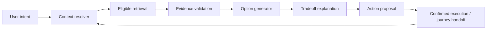

# Ask Mira — interaction and action contract

Ask Mira is an **intent resolver and explanation layer over the same journey state** used by structured planning. It is not a separate chatbot feature or a stronger prompt around the current nine tools. Current `/api/mira` streams Claude/scripted text/cards with current-location context; target work must replace the contract without losing rate limits, grounding filters, emergency fast path or action confirmation. [Current tools](../../src/server/providers/companion/tools.ts), [current guide](../../src/server/providers/companion/claude.ts).

## Processing contract

| Step | Owner and constraint |
|---|---|
| Parse intent | Conversation extracts movement purpose, origin/destination/loop, time, mode and constraints. Never infer a personal threat category from appearance/occupation. |
| Resolve context | Structured resolver checks user-provided facts, current position *if permitted*, saved places *if consented*, planned arrival, time zone and active journey. Current location must not overwrite an explicit future/remote destination. |
| Retrieve | Use geo/routes/place hours, daylight, country profiles, relevant official/development data, eligible community claims. Direct general advice may come from reviewed static content; dynamic local facts require tools. |
| Validate | Deterministic checks enforce source, freshness, geographic/time scope, coverage state, contradictions, claim eligibility and provider licensing. The LLM cannot upgrade evidence. |
| Generate/compare | Deterministic service produces feasible options and explicit tradeoffs. LLM chooses relevant differences and wording; no fabricated “safest” order. |
| Act | Cards have `proposed → user_confirmed → executing → succeeded/failed/unknown` states. Text may claim completion only from a receipt. Starting journey, sharing, calling, reporting and changing route need an explicit user action. |

## Direct versus tool answers

Direct: clarify Mira capability, explain its limits, explain a known displayed claim, or give reviewed generic preparation advice. Tools: any place, route, time, hours, emergency number, live service, current local development, community claim, active journey status or action. Routes are mandatory before comparing route-specific conditions or ETA. Community evidence is optional and cannot be implied where absent. Live/local sources are mandatory for “open now,” disruption or recent event claims; stale source yields “listed/last checked,” not current fact.

## Questions and incomplete inputs

Ask at most **one required clarifying question before giving useful partial value**; a second question is allowed only when the user chooses a more specific comparison/action. If the origin, destination or time is unknown, state the assumption and show what can be done now. Do not force a sign-in or location grant for planning. For a possible emergency, skip clarification and show the urgent path immediately. For discomfort, show practical options before chat.

## Output schema (conceptual)

`understood_intent`; `options[]` with feasibility and tradeoffs; `evidence_claims[]` with source/time/scope; `unknowns[]`; `recommended_next_step` with reason and limits; `action_proposals[]`; `coverage_state`. An answer can say “Option B has a confirmed open entrance and a shorter well-mapped walk; Option A's entrance is unverified,” but not “B is safe” or a numeric crime probability. If no option can be verified, say what was checked, what failed, and offer the next practical choice (including user-supplied information or navigation handoff).

## Active journey and failure

The conversation receives **current journey state and selected option**, recent route/ETA evidence and explicit user changes, not a raw longitudinal GPS trail. If a turn changes the journey, show a new proposal and do not silently overwrite a shared plan. If model/provider fails, the deterministic fallback presents known options or a clear cannot-check state plus support actions. Maintain current emergency-card-before-model behaviour, output validation, privacy scrubbing and rate limits. Saved chat content must be reviewed against [16](16_DATA_AND_PRIVACY_CONTRACT.md).

## Phase 3 local implementation

`/api/mira/plan` is the ephemeral plan-question path for guests and signed-in users with an active plan. It accepts a bounded question and the versioned intent, reuses the Phase 2 OSM/daylight resolver, validates every known evidence claim, then streams source-bound text, a `plan_brief` card and `done` over NDJSON. A danger message emits Emergency before any graph or model call and does not depend on the rate-limit database. The endpoint calls no model and stores no question, plan or reply in `mira_messages`; this is the deterministic fallback itself. Signed-in legacy chat remains available for conversations outside a plan.

When Ask has no resolved plan, conservative text extraction seeds only explicit activity, loop, mode and unresolved `from X to Y` names in the tab plan. It never geocodes silently, infers “from here,” or guesses a local time zone from a remote arrival sentence. The partial answer gives one useful planning fact and asks one place question; the card links to `/plan` for explicit selection. A resolved plan yields the same mapped option facts and unknowns as Around. The card proposes reviewing/completing the plan, and explicitly reports that no journey or share has been executed. Journey start/change action receipts remain Phase 4 work. [Privacy review](25_PHASE_3_PRIVACY_REVIEW.md).
