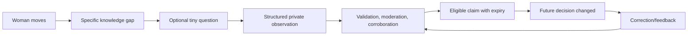

# Community as a governed evidence loop

## Contribution classes and downstream use

| Input | Raw visibility | Eligible downstream claim |
|---|---|---|
| Was a known entrance/open business accessible? | Private; account/visit evidence only where consented | Place availability/entry status at a relevant hour. |
| Route lighting, closure, obstruction, crossing condition | Private exact observation; coarse public segment | Segment condition for intersecting options. |
| Staff/help desk present and willing to assist | Private structured check; no staff identity | “Recently confirmed staffed” only after defined corroboration and expiry. |
| Transit/pickup change | Private, source-checked against operator where possible | Time-limited disruption/wayfinding. |
| Positive observation: active open place, clear access | Private | Actionable alternative, subject to freshness. |
| Incident/discomfort | Private narrative; user chooses whether any aggregate use is allowed | Only privacy-reviewed, non-identifying contextual note; never public accusation or individual pin. |
| “This is wrong now” correction | Private with status receipt | Immediate candidate for recheck; supersedes only under source-specific rules. |

Ask only after a completed journey or while a user explicitly inspects a gap; never interrupt under pressure. A no-answer must have no penalty. A simple place correction can be shown to the next user only after the relevant corroboration/authoritative confirmation rule passes. Existing Mira checks and two-person place-signal threshold are seeds; current reports require moderation and ≥5 independent contributors before public aggregation and public release is off. Do not lower that incident threshold just to fill a feed. [Current contribution design](../CONTRIBUTIONS.md), [moderation](../../MODERATION_POLICY.md).

## Eligibility, abuse and lifecycle

Every submission carries observation time (not only submission time), geographic scope, class, source/proof class, expiry, contributor privacy choice and moderation state. Deduplicate repeated/device-linked claims without displaying contributor identity. Reputation can route review effort but never turns a claim into truth by itself. Coordinate bursts, brigading and false corrections require quarantine and reversible moderation. Demographic labels and descriptions of identifiable people are excluded from public evidence. Expire volatile facts quickly; never infer current state from a historical report. Maintain an appeal/takedown path, audit decision, and contributor receipt showing “received / under review / used in a claim / expired / withdrawn” without exposing other reporters.

The feedback loop must measure **which questions fill a needed data gap and actually change a future answer**, plus correction latency and false-claim rate. No streaks, public leaderboards or points for alarming reports. Product research discusses Waze/OSM/Wikipedia/Reddit/Stack Overflow mechanisms and their transfer limits. [Community research](../mira-product-research/04_COMMUNITY_INTELLIGENCE.md).

## Phase 6 disabled-baseline audit (2026-10-02)

The plan resolver in `src/server/plan/options.ts` consumes the imported OSM walking graph and calculated daylight; it does not read `aggregate_releases`, private reports or place receipts. `MODERATION_POLICY.md` states no one is on moderation duty and public notes are off unless `PUBLIC_AGGREGATE_RELEASES=on`. Existing aggregation tests prove default-off, independence, withdrawal and expiry behavior for the older community endpoint, but they do not authorize plan-linked claims. There is no approved route/time intersection, moderation rota or false-positive impact threshold for the new decision contract. Phase 6 enrichment remains disabled; sparse reports yield no new route conclusion. Do not enable it merely to complete the phase count.
