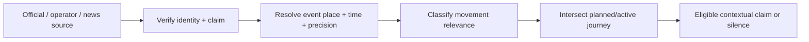

# External developments, advisories and news

Current `safety-intel` ingests GDELT city/region stories, screens headline relevance, deduplicates and shows dated source cards on Today/Around. It does **not** establish route impact, exact event location or live truth. GDELT index time may differ from publication/event time. Preserve its source discipline, but stop using it as a generic feed. [Current pipeline](../../src/server/safety-intel/pipeline.ts), [current source contract](../../src/domain/safety-updates.ts), [ops note](../SAFETY_UPDATES.md).

**Candidate claim types for V1, only with a configured and validated source:** official road closure crossing a selected route; current transit service interruption affecting a chosen leg; severe weather warning relevant to departure/arrival; official venue or transport access notice; an event/protest only when the source supports its geography and timing and it changes a route, mode, pickup or departure choice. News-only incident coverage normally remains background context unless it has a verified ongoing operational implication. A story merely mentioning the same city fails the intersection test.

Each development needs event time (distinct from indexed/published time), affected geometry and precision, source authority for that claim, status, expiry/recheck schedule, confidence class, affected options and suggested adaptation. The system must record when these are unknown; do not project a city story onto a street. Multiple outlets repeating one wire story are not independent corroboration. The classifier may screen relevance; it cannot decide truth or guilt. Place-specific allegations must not become neighbourhood labels.

**V1 availability rule:** if no reliable disruption or official source is configured for a geography, say “I couldn't verify current disruptions here” only when the user asks or a plan needs it. Do not imply no disruption. Keep the existing city-news endpoint behind compatibility UI until the relevance-gated path is accepted, then remove it from the home surface. Push a change only if the user has an active opted-in plan, the evidence is fresh and the option materially changes; otherwise surface in the plan when opened. No celebrity/local-interest feed or fear-based notifications.

**Phase 6 actual state:** The existing `/api/safety-updates` city/region source cards remain accessible through the compatibility `/today` page, with their original source and allegation caveats. The new Go entry does not fetch or display them, and planned walking comparisons/Ask do not promote a headline into a route or service fact. No provider supplies reviewed affected geometry, event time, expiry and operator authority for a chosen leg. Source-rights and claim-threshold review are still required before any such enrichment is enabled; the correct plan answer remains silent or explicitly unknown.
