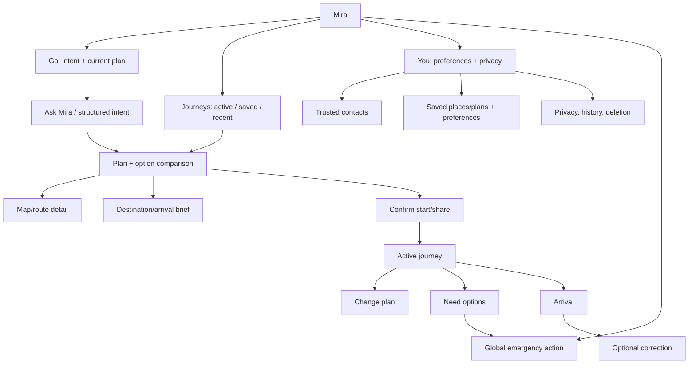

# Target application information architecture

**Locally implemented V1 navigation:** three stable roots — **Go**, **Journeys**, **You**. “Ask Mira” is reachable from Go and planning; map is contextual. Contribution remains available through You and compatibility links. Emergency is a direct action outside chat. This hierarchy still needs independent task and accessibility validation. `NEXT_PUBLIC_MIRA_GO_ENTRY=legacy` restores the previous five-tab hierarchy in a rebuilt artifact; `/today` preserves its content as a compatibility route.

## Entry rules

- First session: welcome → guest Go → first useful plan; request precise location only when “from here” is chosen. Account gate only for save/share/identified contribution.
- Reopening with active journey: active card and route/support actions dominate Go and Journeys. The user can still ask or change a plan.
- Reopening with no journey: recent **user-approved** saved plan and one new intent CTA. No passive routine suggestion until consent is clear.
- Journeys lists user-saved plans separately from the two-hour tab draft. Opening a saved plan copies it to the editable tab draft; no journey or share begins. Plans expire after 30 days or can be deleted. Go itself does not auto-open an account plan.
- Incoming share/invite links retain their separate token routes and never expose the full app/account.
- `I need options` and Emergency are always available from Go, plan, map and active journey. Emergency must not require model/network.
- Search, route and support views return to the same plan object; leaving a view does not erase the woman's intent or choices.

## Compatibility routes during migration

Keep `/around`, `/around/map`, `/mira`, `/contribute`, `/report`, `/trips`, `/trip`, `/circle` and share/admin URLs functional until their replacement passes parity tests. Old routes may redirect to a new state only after they can preserve destination, active journey and privacy. Stable deep links and notification `href` values need explicit verification. [Current routes](02_CURRENT_PRODUCT_MAP.md), [migration](19_MIGRATION_PLAN.md).
