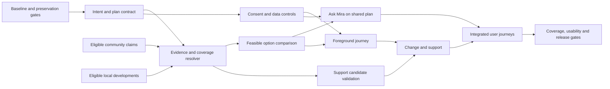

# Build dependencies and ordering

The product has one shared **intent → plan → journey** object. A screen that appears complete without the underlying evidence, consent and failure states does not count as a completed dependency. This graph is a build order, not a commitment to invent missing local data.

The core path must work when `K` and `L` have no eligible data. Empty community or news coverage is never a reason to fabricate an answer.

| Dependency | Must exist before | Exit evidence | Existing foundation |
|---|---|---|---|
| Baseline preservation | Any product change | Current tests and critical flows recorded; dirty working tree protected | Existing tests, worker and privacy docs |
| Shared intent/plan | Comparative result, Ask integration, journey start | Remote and future intent persists across text/map/action views without a location grant | Today, Around, Mira, `/api/geo/*` |
| Evidence and coverage | Any contextual claim | Source, age, geographic/time scope, missing/contradictory status carried into UI | `src/domain/context.ts`, provider and country data |
| Feasible option comparison | Recommendation or route choice | Provider route/ETA basis and unknowns; no invented alternative | Geo provider/route endpoint |
| Consent and minimal storage | Saved plans, sharing, personal memory | Opt-in, deletion, recipient and provider disclosures tested | Account, trip and retention systems |
| Journey continuity | Mid-journey Ask/change/support | Chosen plan referenced by active trip; foreground limits and stale-location state visible | `/trip`, worker, trip API |
| Support validation | “Best available place” claim | Hours/source/route/appropriateness explicit; unknown staffing labelled | Help Points candidate ranking |
| Community eligibility | Any observation used as guidance | Moderation, freshness, independence, correction and removal path | Checks, reports, aggregates |
| Local development eligibility | Any news affecting a route | Event time, exact scope, source and actionable connection to selected movement | Safety-intel pipeline |

## Parallel work boundaries

After the plan/evidence interfaces are settled, support-place verification, country baseline coverage, community eligibility and local-development rules can progress independently. Only eligible claims enter the shared resolver. IA can be prepared in parallel, but must not become the default until planning, emergency, active-trip and deep-link parity pass. Native/background navigation, provider maneuvers, live service reliability and city-level support networks remain separate capability gates.

## Stop conditions

Stop a phase if it needs a safety claim without evidence, stores a sensitive intent without an explicit purpose/retention rule, silently changes a shared plan, weakens emergency or worker behaviour, or makes an unsupported global/local coverage claim. Record the failed dependency and use the honest baseline path in [12](12_GLOBAL_COVERAGE_MODEL.md) and [20](20_ACCEPTANCE_TESTS.md).
